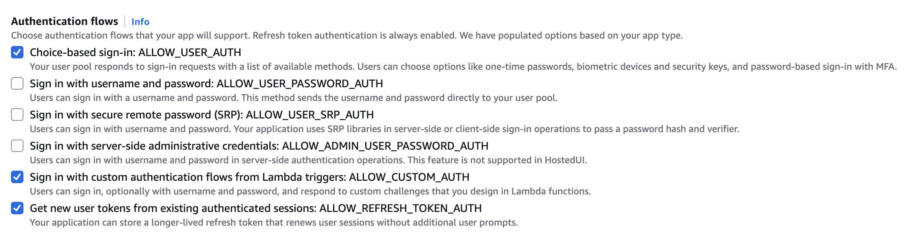
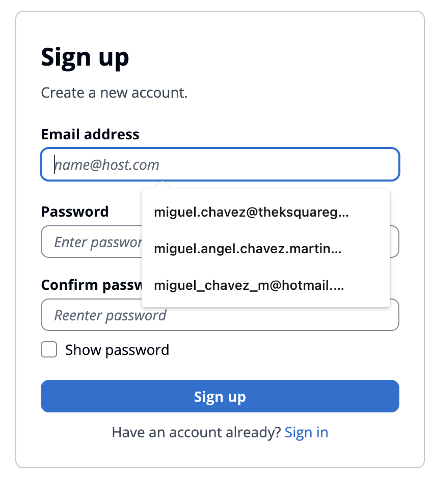
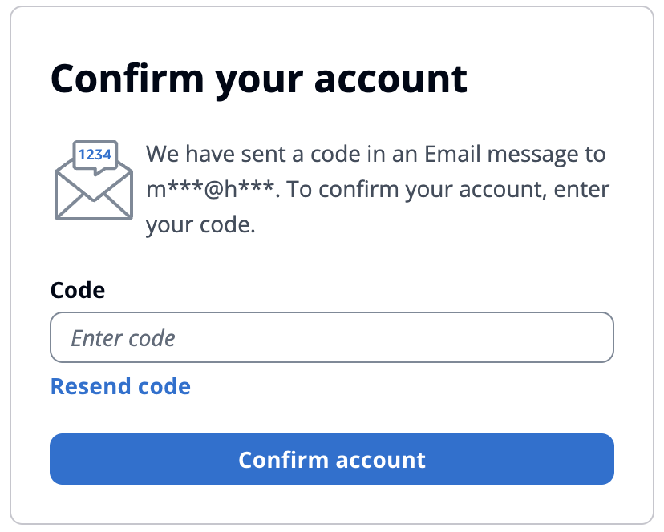
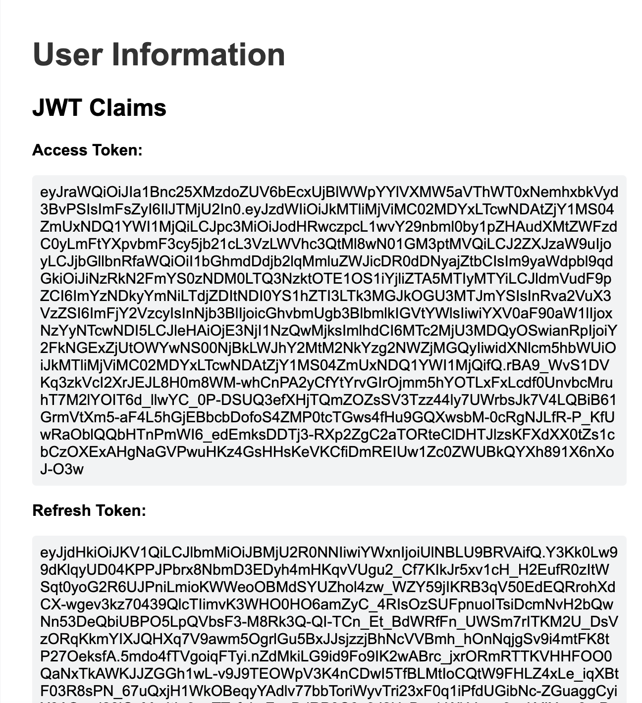
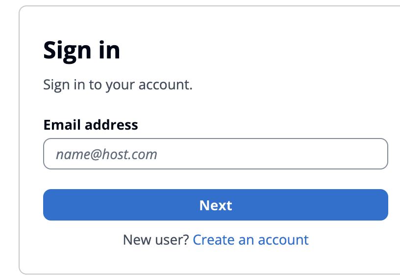
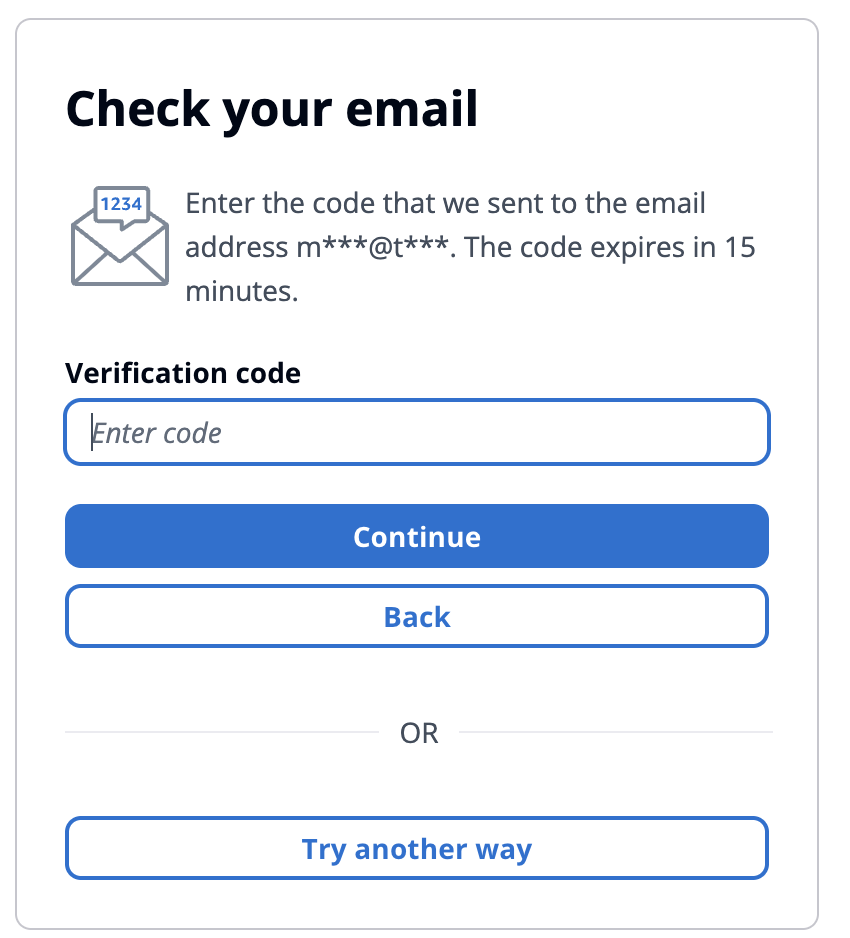

# Proof of Concept: AWS Cognito
## Document Purpose
This document provides:
  - **Setup instructions**
  - **AWS CLI commands**
  - **Curl commands**

**Goals:**
  1. Sign up user (email-only / password-less)
  2. Sign in user (email-only / password-less, or with pre-registered credentials)
  3. Receive access token (JWT) and refresh token
  4. Get the certificate/public key to verify JWT signature
  5. Get a new JWT access token using the refresh token

This guide is intended for iOS engineers implementing client-side logic.


**Expected Flow:**


## Setup Instructions AWS Cognito Platform
You’ll need:
  - Cognito User Pool. `COGNITO_USER_POOL_ID`.
  - App Client. `COGNITO_APP_CLIENT_ID`.
  - AWS Region associated with Amazon Cognito. `AWS_REGION`.
  - The AWS CLI installed and configured (`aws configure`).
  - Authentication flows(`ALLOW_USER_AUTH`,`ALLOW_CUSTOM_AUTH`,`ALLOW_REFRESH_TOKEN_AUTH`)

#### Authentication flows


### Cognito User Pool. `COGNITO_USER_POOL_ID`
#### Using the AWS Management Console:
- Sign in to the [AWS Management Console](https://console.aws.amazon.com/cognito)
- Choose the region where your user pool exists.
- Go to **Amazon Cognito → User Pools**.
- Select your user pool.
-  On the **“User pool information”** page, the `User pool ID` is your `COGNITO_APP_CLIENT_ID`. 
You’ll see something like:
```
us-east-1_aBcDeFGHI
```
That’s your **User Pool ID**.

#### Using the AWS CLI
List user pools
```
aws cognito-idp list-user-pools --max-results 10
```
```json
{
    "UserPools": [
        {
            "Id": "us-east-2...",
            "Name": "User pool - kmucem",
            "LambdaConfig": {},
            "LastModifiedDate": "2025-10-20T12:01:43.244000-06:00",
            "CreationDate": "2025-10-20T10:59:22.662000-06:00"
        }
    ]
}
```
Then:
```
aws cognito-idp describe-user-pool --user-pool-id <your_user_pool_id>
```

```json
{
    "UserPool": {
        "Id": "us-east-2...",
        "Name": "User pool - kmucem",
        "Policies": {
            "SignInPolicy": {
                "AllowedFirstAuthFactors": [
                    "PASSWORD",
                    "EMAIL_OTP"
                ]
            }
        },
        "SmsConfigurationFailure": "SNSSandbox",
        "Domain": "us-east...",
        "AdminCreateUserConfig": {
            "AllowAdminCreateUserOnly": false,
            "UnusedAccountValidityDays": 7
        },
        "Arn": "arn:aws:cognito-idp:us-east-2:501472650404:userpool/us-east-2...",
        "UserPoolTier": "ESSENTIALS"
    }
}
```
---

### App Client. `COGNITO_APP_CLIENT_ID`
#### Sign in to the AWS Management Console
- Sign in to the [AWS Management Console](https://console.aws.amazon.com/cognito)
- Choose the region where your user pool exists.
- Select the User Pool you’re using.
- In the left menu, select **Applications → App clients**. You’ll see a list of app clients.
- Select the App client name you’re using. The **Client ID** column shows the value you need — this is your `COGNITO_APP_CLIENT_ID`.

#### Create a new App Client (if you don’t have one yet)
- In the **App clients** section, click Create app client.
- Give it a name (for example, `my-web-app-client`).
- Configure settings:
- If it’s for a public web or mobile app, **don’t enable client secret**.
- If it’s for a backend service, you can enable client secret.
- Click **Create app client**.
- Copy the **App client ID** from the confirmation screen — that’s your `COGNITO_APP_CLIENT_ID`

#### Using the AWS CLI
```bash
aws cognito-idp list-user-pool-clients --user-pool-id <your_user_pool_id>
```

You’ll get output like:
```json
{
    "UserPoolClients": [
        {
            "ClientId": "33vu9td0v0l3sll8sva5vu8j72",
            "UserPoolId": "us-east-2_MuLHvXh19",
            "ClientName": "ksquare-biolinq"
        }
    ]
}
```
The `ClientId` value is your `COGNITO_APP_CLIENT_ID`.

**Reference:** [Amazon Cognito Documentation](https://docs.aws.amazon.com/cognito/)

## Key Operations & Endpoints
Amazon Cognito user pools are directories, single sign-on endpoints, and OAuth 2.0 servers. 
**To sign up/sign in users using Amazon Cognito, you can do it via the AWS SDK.**
## Setup

**Clone the repository**
   ```sh
   git clone git@github.com:ksquare-mchavez/cognito-microservice.git
   cd cognito-microservice
   ```

**Install dependencies**
   ```sh
   go mod tidy
   ```

**Set Cognito credentials as environment variables:**
```env
    COGNITO_CLIENT_ID=your_client_id
    COGNITO_USER_POOL_ID=your_user_pool_id
    AWS_REGION=your_aws_region
    COGNITO_REDIRECT_URL=http://localhost:8080/callback
    COGNITO_ISSUER_URL=https://cognito-idp.us-east-2.amazonaws.com/your_pool_id
    COGNITO_DOMAIN=<your-domain>.auth.<region>.amazoncognito.com/
```
Examples
```
      - COGNITO_CLIENT_ID=5lhft7coij2ine...
      - COGNITO_USER_POOL_ID=us-east-2_07M...
      - AWS_REGION=us-east-2
      - COGNITO_CLIENT_SECRET=''
      - COGNITO_REDIRECT_URL=http://localhost:8080/callback
      - COGNITO_ISSUER_URL=https://cognito-idp.us-east-2.amazonaws.com/us-east-2_07M...
      - COGNITO_DOMAIN=us-east-207mf3zm1t.auth.us-east-2.amazoncognito.com
```

**Get you domain name:**
- Open Amazon Cognito in the AWS Management Console → `User pools` → Select your user pool.
- In the left-hand menu, go to `Branding` → `Managed login`.
- Find the section titled `Managed login settings`. Under `Domains with managed login branding`, you’ll see `your domain` listed.

**Run the server locally**
   ```sh
   go run cmd/main.go
   ```

**Run with Docker Compose(Recommended)**
   ```sh
    docker-compose up --build
   ```
   The application will start on `http://localhost:8080`.

---

### 1. Sign up user (email-only / password-less)
Users can sign up without a password when your user pool supports passwordless
sign-in with email or SMS OTPs. To create a user with no password, omit this
parameter. You can only create a passwordless user when
passwordless sign-in is available.

#### Sign up user without password.
**Example using AWS SDK**
```sh
curl -X POST http://localhost:8080/register \
  -H "Content-Type: application/json" \
  -d '{"email":"user@example.com"}'
```

**output:**
```json
{
    "auth": {
        "challenge_name": "EMAIL_OTP",
        "session": "AYABeMqX5progkTA4knko0-rFQoAHQA..."
    },
    "message": "User registration successful. Please check your email for confirmation.",
    "user_sub": "41ebb560-3091-7040-356a-dbbb5d6f31b2"
}
```
**Example using AWS CLI**
```sh
aws cognito-idp sign-up \
    --client-id 1h57kf5cpq17m0eml12EXAMPLE \
    --username user@example.com \
    --user-attributes Name=email,Value=user@example.com
```
**output:**
```json
{
    "UserConfirmed": true,
    "UserSub": "81ab2530-4071-7087-0370-cf23b91e377e",
    "Session": "AYABeEZo9Zjev75RrCcle8Tq1..."
}
```
**Confirm the User (if required)**
```sh
aws cognito-idp confirm-sign-up \
    --client-id <your_app_client_id> \
    --username <username_or_email> \
    --confirmation-code <code_from_email_or_sms>
```
Example:
```sh
aws cognito-idp confirm-sign-up \
    --client-id 1h57kf5cpq17m0eml12EXAMPLE \
    --username johndoe@example.com \
    --confirmation-code 123456
```
**Optional: Admin Confirms User (No Code Needed)**
```sh
aws cognito-idp admin-confirm-sign-up \
    --user-pool-id <your_user_pool_id> \
    --username <username_or_email>
```
Example:
```sh
aws cognito-idp admin-confirm-sign-up \
    --user-pool-id us-east-1_AbCdEfGHI \
    --username johndoe@example.com
```

#### Verify OTP and Login using AWS SDK
**Example:**
```sh
curl -X POST http://localhost:8080/verify-otp \
  -H "Content-Type: application/json" \
  -d '{
    "username": "user@example.com",
    "otp": "123456",
    "challenge_name": "EMAIL_OTP",
    "session": "SESSION_STRING_FROM_PREVIOUS_STEP"
  }'
```

**output:**
```json
{
    "access_token": "eyJraWQiOiJIa1Bnc2...",
    "id_token": "eyJraWQiOiI2a1d...",
    "refresh_token": "eyJjdHkiOiJKV..",
    "token_type": "Bearer"
}
```

#### Confirm the Signup using AWS CLI (Verify OTP)
```sh
aws cognito-idp confirm-sign-up \
  --client-id <your_app_client_id> \
  --username <username_or_email_or_phone> \
  --confirmation-code <otp_code>
```

**Example:**
```sh
aws cognito-idp confirm-sign-up \
  --client-id 1h57kf5cpq17m0eml12EXAMPLE \
  --username johndoe@example.com \
  --confirmation-code 456789
```

**Response**
```json
{
    "UserConfirmed": true
}
```
#### Admin Alternative
If you have admin permissions and want to skip the OTP entirely, you can confirm the user manually:
```sh
aws cognito-idp admin-confirm-sign-up \
  --user-pool-id <your_user_pool_id> \
  --username <username_or_email_or_phone>

```

#### (Optional) Resend OTP if User Didn’t Receive It
```sh
aws cognito-idp resend-confirmation-code \
  --client-id <your_app_client_id> \
  --username <username_or_email_or_phone>
```
**Example:**
```sh
aws cognito-idp resend-confirmation-code \
  --client-id 1h57kf5cpq17m0eml12EXAMPLE \
  --username johndoe@example.com
```
This will trigger Cognito to send a new verification code.

#### Example using AWS Cognito Hosted UI
If you’ve set up a Cognito User Pool domain, Cognito automatically gives you a hosted login page.
You can redirect your users to that page via code.
We are going to use the Amazon Cognito login page provided by Cognito Hosted UI(recommended).
#### Go to http://localhost:8080 and Click on `Create an account`
#### You must provide email and password when using the Hosted(integrated) UI.
- When using the Cognito-provided UI, you cannot omit the password.


#### Click on Sign up. You will receive an OTP code in your email.
#### Enter the OTP and Click on `Confirm account`.


#### Response:


### 2. Sign in user (email-only / password-less, or with pre-registered credentials)
#### Sign in users without password.
**Example using the AWS SDK**
```sh
curl -X POST http://localhost:8080/initiate-auth \
  -H "Content-Type: application/json" \
  -d '{"email":"user@example.com"}'
```
**output:**
```json
{
    "challenge_name": "EMAIL_OTP",
    "session": "AYABeGum6hMDKmw86TktjgI_..."
}
```

**Example using the AWS CLI**
```sh
aws cognito-idp initiate-auth \
  --auth-flow USER_AUTH \
  --client-id 1h57kf5cpq17m0eml12EXAMPLE \
  --auth-parameters USERNAME=user@example.com
```

**Response:**
```json
{
    "ChallengeName": "EMAIL_OTP",
    "Session": "AYABeMHSh5AWFfJTNjaP...",
    "ChallengeParameters": {
        "CODE_DELIVERY_DELIVERY_MEDIUM": "EMAIL",
        "CODE_DELIVERY_DESTINATION": "m***@h***"
    },
    "AvailableChallenges": [
        "EMAIL_OTP"
    ]
}
```

#### Verify OTP and Login using AWS SDK
**Example using the AWS SDK**
```sh
curl -X POST http://localhost:8080/verify-otp \
  -H "Content-Type: application/json" \
  -d '{
    "username": "user@example.com",
    "otp": "123456",
    "challenge_name": "EMAIL_OTP",
    "session": "SESSION_STRING_FROM_PREVIOUS_STEP"
  }'
```
**Response:**
```json
{
    "access_token": "eyJraWQiOiJIa1Bnc2...",
    "id_token": "eyJraWQiOiI2a1d...",
    "refresh_token": "eyJjdHkiOiJKV..",
    "token_type": "Bearer"
}
```

**Example using the AWS CLI**
```sh
aws cognito-idp respond-to-auth-challenge \
  --client-id 1h57kf5cpq17m0eml12EXAMPLE \
  --challenge-name EMAIL_OTP \
  --session AYABeExampleSessionToken... \
  --challenge-responses USERNAME=user@example.com,EMAIL_OTP_CODE=123456
```

**Response**
```json
{
    "ChallengeParameters": {},
    "AuthenticationResult": {
        "AccessToken": "eyJraWQiOiJIa...",
        "ExpiresIn": 3600,
        "TokenType": "Bearer",
        "RefreshToken": "eyJjdHkiOiJKV1Q...",
        "IdToken": "eyJraWQiOiI2a1drZjRY..."
    }
}
```

#### Sign in users without password using hosted UI.
#### Enter the email address


#### Click on Next. You will receive an OTP code in your email.
#### Enter the OTP and Click on `Continue`.


#### Response:


### 3. Receive Access Token (JWT) and Refresh Token
- Check response on Step 1 and 2

### 4. Get the Certificate/Public Key to Verify JWT Signature
For Amazon Cognito user-pool JWT tokens you can use the following JWKS (JSON Web Key Set) URL to verify token signatures:
```bash
https://cognito-idp.<REGION>.amazonaws.com/<USER_POOL_ID>/.well-known/jwks.json
```

For example: https://cognito-idp.us-east-1.amazonaws.com/us-east-1_XXXXXXXXX/.well-known/jwks.json

If you want to find the Amazon Cognito token signing key URL using the AWS Management Console (UI) instead of constructing it manually, here’s how you can do it step-by-step:

- Sign in to the [AWS Cognito Management Console](https://console.aws.amazon.com/cognito)
- Open your User Pool
- Select “User Pools” from the sidebar.
- Click the name of the user pool you want to use.
- Click on the Overview and look for: **Token signing key URL**. This link will contain the url for the user pool token signing keys.

### 5. Get a New JWT Access Token Using the Refresh Token

#### Get you domain
1. Open Amazon Cognito in the AWS Management Console.
2. Click on `User pools`.
3. Select your user pool.
4. In the left-hand menu, go to `Branding` → `Managed login`.
5. Find the section titled `Managed login settings`.
6. Under `Domains with managed login branding`, you’ll see `your domain` listed.

**Example:**
```bash
curl -X POST "https://<your-domain>.auth.<region>.amazoncognito.com/oauth2/token" \
  -H "Content-Type: application/x-www-form-urlencoded" \
  -d "grant_type=refresh_token&client_id=<your_client_id>&refresh_token=<refresh_token>"
```
```
your-domain: us-east-207mf...
region: us-east-2
your_client_id: 5lhft7coij2inebbp...
```
**Response:**
```json
{
  "access_token": "eyJraWQiOiJ...",
  "id_token": "eyJraWQiOiJ...",
  "token_type": "Bearer",
  "expires_in": 3600
}
```

#### General Notes about attributes
There are 3 categories of attributes:
- Standard attributes (built-in by Cognito)
- Custom attributes (you define these)
- Alias attributes (alternative login identifiers like email, phone number, username)

1. Standard Cognito User Attributes
These come out-of-the-box in every User Pool:
 --------------------------------------------------------------------------------
| Attribute name          | Description                                          |
| ----------------------- | ---------------------------------------------------- |
| `address`               | Full mailing address                                 |
| `birthdate`             | Date of birth (ISO 8601 format)                      |
| `email`                 | User’s email address                                 |
| `email_verified`        | Whether the email has been verified (`true`/`false`) |
| `family_name`           | Last name                                            |
| `gender`                | User’s gender                                        |
| `given_name`            | First name                                           |
| `locale`                | User’s locale (e.g., `en_US`)                        |
| `middle_name`           | Middle name                                          |
| `name`                  | Full name                                            |
| `nickname`              | Nickname                                             |
| `phone_number`          | User’s phone number (E.164 format)                   |
| `phone_number_verified` | Whether the phone number has been verified           |
| `picture`               | URL to user’s picture                                |
| `preferred_username`    | Alternative username                                 |
| `profile`               | URL to user’s profile page                           |
| `updated_at`            | Last profile update timestamp                        |
| `website`               | User’s website URL                                   |
| `zoneinfo`              | User’s time zone                                     |
| `sub`                   | The unique Cognito user ID (read-only)               |

2. Custom Attributes
These are attributes you (or an admin) create manually when configuring the user pool.
They always start with custom: — for example:
 ---------------------------------------------------------
| Example             | Description                       |
| ------------------- | --------------------------------- |
| `custom:role`       | User’s role (admin, member, etc.) |
| `custom:department` | Department name                   |
| `custom:planType`   | Subscription plan                 |

3. Alias Attributes
Aliases let users log in using attributes like email, phone, or preferred username.
Common alias attributes:
- email
- phone_number
- preferred_username

These can be configured in your user pool settings under Sign-in options.

4. List Attributes using AWS CLI

```sh
aws cognito-idp describe-user-pool \
  --user-pool-id <USER_POOL_ID> \
  --query "UserPool.SchemaAttributes[*].Name"
```

Output
```
[
  "sub",
  "email",
  "email_verified",
  "phone_number",
  "phone_number_verified",
  "custom:role",
  "custom:department"
]
```

5. Get attributes for any user (Admin access)
 ```sh
 aws cognito-idp admin-get-user \
  --user-pool-id <USER_POOL_ID> \
  --username <USERNAME>
 ```
Output
```
{
    "Username": "user123",
    "UserAttributes": [
        { "Name": "sub", "Value": "xxxxxxxx-xxxx-xxxx-xxxx-xxxxxxxxxxxx" },
        { "Name": "email", "Value": "user@example.com" },
        { "Name": "custom:role", "Value": "admin" }
    ],
    "UserCreateDate": "2025-01-01T10:00:00Z",
    "UserLastModifiedDate": "2025-02-01T12:00:00Z",
    "Enabled": true,
    "UserStatus": "CONFIRMED"
}
```

6. Update those attributes using AWS CLI
```sh
aws cognito-idp admin-update-user-attributes \
    --user-pool-id us-east-2_07MF3zm1T \
    --username miguel.chavez@theksquaregroup.com \
    --user-attributes Name="middle_name",Value="Angel" Name="family_name",Value="Chavez"
```
Output
```
aws cognito-idp admin-get-user \
  --user-pool-id us-east-2_07MF3zm1T \
  --username miguel.chavez@theksquaregroup.com
{
    "Username": "51ab5560-9061-70c9-1cef-751d584070eb",
    "UserAttributes": [
        {
            "Name": "email",
            "Value": "miguel.chavez@theksquaregroup.com"
        },
        {
            "Name": "email_verified",
            "Value": "true"
        },
        {
            "Name": "family_name",
            "Value": "Chavez"
        },
        {
            "Name": "middle_name",
            "Value": "Angel"
        },
        {
            "Name": "address",
            "Value": "Managua,Nicaragua"
        },
        {
            "Name": "sub",
            "Value": "51ab5560-9061-70c9-1cef-751d584070eb"
        }
    ],
    "UserCreateDate": "2025-11-11T11:23:11.746000-06:00",
    "UserLastModifiedDate": "2025-11-11T15:00:16.207000-06:00",
    "Enabled": true,
    "UserStatus": "CONFIRMED"
}
```